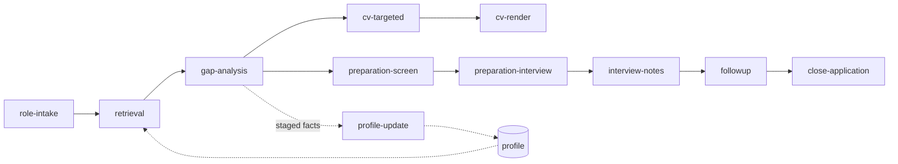

# career

**An end-to-end, human-gated system for pursuing a job: understanding the role, confronting the gaps, deciding the positioning, holding a stance in the room, and producing the cited artifacts that follow from those decisions.**

Functionality:
- ingests a job description,
- researches the industry, company and role,
- classifies the job on five orthogonal axes,
- retrieves matching evidence from a structured career profile,
- scores candidate-to-role fit,
- drafts the CV against that evidence, and
- prepares each interview round.

Every factual claim in every deliverable traces to a specific profile entry. Anything the profile does not support is surfaced as a gap and put to the candidate; it is never filled in.

Built on Claude Code: 18 skills, 35 sub-agents, 33 Python scripts, backed by an invariant test suite. Per-component documentation lives in [`COMPONENTS.md`](COMPONENTS.md); live design state in [`design/`](design/).

---

## What it is for

The CV, research, prep documents and follow-up communication are the visible output. The value offered is the deliberation that produces them.

Every phase either interacts directly with the user or is gated for human review and acceptance at the end, and often both. The system does the research, the retrieval, the scoring, and the drafting, then stops and hands the judgment back. Those gates are where the candidate does the actual work, and they are sequenced so that the cheap thinking happens before the expensive effort.

- **Understand the role.**
  - Intake researches the company, the role as the sector actually defines it, and the industry, then classifies the job on five axes.
  - Role requirements are then extracted across the whole posting rather than the section labeled "Requirements."
  - The candidate comes out understanding the job better than the posting states it.

- **Confront the gaps.**
  - Gap analysis names every critical requirement the user's profile does not cover and walks them one at a time.
  - Some gaps close on evidence not currently in the profile, or on the candidate's elaboration of existing evidence into more specific detail.
  - Some do not close, and the candidate decides how they will be handled in an interview.
  - The fit score and the pursue decision wrap up the phase before a single line of CV is written.

- **Decide the positioning.**
  - which strengths lead,
  - which real experience gets de-emphasized because it dilutes the narrative for this role,
  - what the candidate is choosing to be in this application.
  - de-emphasis decisions and the arbitration behind them are recorded, so a choice can be revisited rather than re-argued.

- **Hold a stance.**
  - Preparation produces
    - spoken cue arcs rather than a script,
    - guards on the questions that are hard to answer diplomatically,
    - a confirmation question attached to anything inferred rather than known, and
    - a compensation position taken before the call instead of during it.

- **Know the candidate.**
  - A separate behavioral self-assessment, governed by its own versioned protocol and rerun annually, exists to answer where this person actually thrives, where they will struggle, and which tensions are load-bearing.
  - Positioning that ignores that is guesswork.

- **Compound the learning.**
  - Every interview debrief, every fact surfaced under questioning, and every reframe feeds back into the profile through a staged review queue.
  - The tenth application starts from a materially better profile than the first.

The gates are also the honesty mechanism. A system that could not stop and say "the profile does not support this" would simply write the claim.

---

## Why it is built this way

Two failure modes drove the architecture.

**Fabrication.** An LLM asked to write a CV will quietly smooth over a missing qualification. Here, every content unit carries a source citation, a quality gate verifies the cited entry actually supports the claim it is attached to, and a global rule forbids interpolation. A gap is reported, not filled.

**Context bloat.** This repo is a ground-up rebuild of a predecessor (`career_development`) that loaded whole profile documents into every skill and eventually became unworkable. Retrieval here is slice-based: scripts address and extract the fragments a phase needs, which works because the profile documents are built to a known structure and aligned to the core axes. No skill ever loads a profile document whole. Axis rule files are read by a classifier sub-agent and never enter the main session context.

---

## Approach

Human-gated AI workflow built on Claude Code, with explicit user checkpoints rather than full autonomy. The LLM is currently the primary orchestrator; a LangGraph project to remove the LLM from the orchestration path is in progress. Python scripts own all deterministic logic: retrieval, assembly, formatting, and validation.

Seven principles do the structural work.

**1. Deterministic checks and judgment checks are separated, and neither repeats the other.**
Every quality gate is a pair.
- A Python script owns everything mechanically verifiable:
  - section structure,
  - field presence,
  - ID resolution,
  - cross-file equality,
  - arithmetic,
  - date form,
  - banned constructions.
- A sub-agent owns only what requires reading comprehension:
  - does this cited entry genuinely support this claim,
  - does the hedge survive,
  - is the reasoning actually present.
- `gap_qc.py` runs eleven mechanical checks and explicitly does not judge;
- `qc-gap-analysis` judges Notes substance and explicitly does not re-run the eleven.
- This keeps the expensive layer small and the cheap layer exhaustive.

**2. Retrieval is slice-based.**
`profile_slice.py`, `retrieval_payload.py`, and `retrieval_apply.py` chunk, score, and merge addressed fragments. A scoring sub-agent sees one chunk at a time. The main session sees a manifest.

**3. Classification runs on five orthogonal axes.**
- Each axis gets a folder of value/vocabulary files under `rules/` plus a registry:
  - orientation,
  - industry,
  - specialty,
  - level,
  - work-state.
- Every value file carries an `Adjacency` section, so a partial match scores through an adjacency map rather than collapsing to a binary hit.
- Axis vocabulary aligns the verbiage, tone, level and state to the role.

**4. Each document has exactly one writer.**
The profile documents are read by nearly everything and written by exactly one skill, `profile-update`. Facts surfaced mid-run go to a staging queue as `PU-NNN` entries via `staging_append.py`, and are promoted later under user review. The queue holds what is waiting; the inventory is where information persists. This removes concurrent drift as a class of bug.

**5. A phase produces its declared output and nothing else.**
No forward-looking commentary, no work belonging to a later skill. Role intake may report that a job description contradicts itself; it may not report how the candidate scores against it.

**6. Approval gates open in plain language.**
The first two lines of any gate are what breaks in plain words, then what the system proposes to do. No filenames, IDs, or jargon above those two lines. Detail sits underneath for whoever wants it.

**7. Nothing is hardcoded.**
`config.yaml` holds every folder name, filename, ID pattern, axis schema, and tuning cutoff. Scripts resolve the repo root from `__file__`. A repo reorganization is a config edit rather than a code change.

Failure handling is uniform: on any quality-check failure, load failure, or ambiguous input, a component halts, states the specific failure, presents explicit options, and waits. Silence is not approval.

---

## Pipeline



| # | Stage | Skill | Reads | Writes |
|---|---|---|---|---|
| 1 | Role intake | `role-intake` | Job description, web research | `research.md`, `session_log.md` |
| 2 | Retrieval | `retrieval` | `research.md`, profile slices | `retrieval.md` |
| 3 | Gap analysis | `gap-analysis` | `retrieval.md`, `research.md` | `gap_analysis.md`, staged `PU-NNN` entries |
| 4 | CV content | `cv-targeted` | `gap_analysis.md`, `retrieval.md`, axis files | `cv_content.md` (cited), `drafting_plan.md` |
| 5 | CV render | `cv-render` | `cv_content.md` | formatted `.docx` |
| 6 | Screen prep | `preparation-screen` | `gap_analysis.md`, profile, live research | `interview_prep.md` |
| 7 | Interview prep | `preparation-interview` | above plus `rules/interview-types/` | `interview_prep.md` (extended) |
| 8 | Note taking | `interview-notes` | `interview_prep.md`, `session_log.md` | `interview_notes.md` |
| 9 | Follow-up | `followup` | round debrief in `interview_notes.md` | `followup_<stage>_<date>.md` |
| 10 | Closure | `close-application` | outcome from the user | session-log outcome, scratch wipe |

Every artifact for one job lands in a single folder, `personal/applications/<SLUG>_APP-NNN_YYYY-MM/`, keyed by a global application counter. `session_log.md` is shared: each skill appends its own section, so the folder is a complete record of the pursuit.

**Supporting procedures**

| Procedure | Skill | Notes |
|---|---|---|
| Profile creation | *planned* | Inventory, narratives, positioning, and user info are hand-authored today against `templates/inventory.md` |
| Profile updates | `profile-update` | The only writer to the profile documents |
| Axis authoring | five `*-builder` skills | Research, draft, reconcile against siblings, QC, register a new axis value |
| Self-assessment | `self-assessment` | Thin orchestrator over a versioned protocol in `rules/self-assessment/` |
| Career brief | `career_brief` | Draft skeleton; full design pending |
| Presentation prep | *planned* | Tracked in `design/deferrals.md` |
| Offer negotiation | *planned* | Compensation is calibrated and a position prepared during screen prep, and `close-application` records an accepted or declined offer, but the negotiation itself has no stage yet |

---

## CV drafting is adversarial

`cv-targeted` runs a lead writer against a standing panel of three opposed reviewers. `cv-architect` composes and owns the final cited text. Three read-only stakeholders pull against each other on every round:

- **`career-strategist`** argues craft: impact-first framing, quantification, line economy, screening soundness.
- **`hiring-manager`** argues from the employer's seat: are the critical requirements visibly and credibly met.
- **`candidate-advocate`** argues undersell: a real strength buried, compressed, or dropped.

**The panel runs as a Delphi.** The three are polled in parallel and never see each other's output, so no reviewer anchors on another and the loudest voice cannot dominate. The architect is the single reconciliation point. On each later round a reviewer receives only the revised draft and the architect's disposition of its own prior contributions, which is the controlled feedback that makes the method converge instead of oscillate. The loop ends when all three return `satisfied`, capped at three rounds; unresolved contributions surface to the user rather than blocking the run.

None of the three can write. Every material contribution is recorded in `cv_collaboration_log.md` with the architect's disposition (integrated, partial, or declined) and the reason given back to the reviewer, so nothing is dropped silently and a decision to overrule a stakeholder is inspectable later. Cross-reviewer conflicts are arbitrated by precedence and logged in `drafting_plan.md`.

The panel is also a context strategy. Each reviewer persists for the life of the run and holds its own sources in an isolated context, so it re-assesses a revised draft without re-reading its corpus. The main session accumulates only compact contributions and a round counter.

Quality control then runs the split from principle 1: `cv_qc.py` for structure, citation presence, length, and AI-tell patterns; `qc-cv-targeted` for semantic traceability, reading only the cited slices so it stays context-bounded.

---

## Quality control

Every skill that produces a durable artifact is gated by a script and, where judgment is required, a paired agent.

| Skill | Deterministic gate | Judgment gate |
|---|---|---|
| `role-intake` | `role_intake_qc.py` | `qc-role-intake` |
| `retrieval` | `retrieval_qc.py` | none needed; all checks were mechanical |
| `gap-analysis` | `gap_qc.py` | `qc-gap-analysis` |
| `cv-targeted` | `cv_qc.py` | `qc-cv-targeted` |
| `preparation-screen` | `prep_qc.py` | `qc-preparation-screen` |
| `preparation-interview` | `prep_interview_qc.py` | `qc-preparation-interview` |
| `profile-update` | `profile_update_qc.py` | `qc-profile-update` |
| `self-assessment` | `self_assessment_qc.py` | `qc-self-assessment` |
| `*-builder` (five axes) | `axis_qc.py` | `qc-<axis>-builder` |

Scripts emit per-check `PASS`/`FAIL` lines and exit non-zero on any failure, so they gate a run rather than advise it. `retrieval` losing its judgment agent is deliberate: its checks turned out to have no judgment residue, and an agent that only re-runs a script is cost without signal.

---

## Testing

```powershell
python tests\run_tests.py              # all checks
python tests\run_tests.py --only counter
```

Checks run against `tests/fixture/`, a complete invented candidate. Nothing in it describes a real person, employer, or job. `run_tests.py` sets `CAREER_FIXTURE`, copies the corpus to a throwaway folder, and refuses to start unless the resolved profile path is inside `tests/`, so a check cannot reach the real profile even by mistake.

Three conventions:

- **Every check corresponds to a defect that actually shipped.** The suite is a record of what has broken, not a guess at what might. Each docstring names what it caught.
- **A check is only finished once it has been seen to fail.** Reintroduce the bug, watch it go red, restore. A check that has only ever passed proves nothing.
- **Two checks test the checkers.** They break the fixture nine different ways and require a complaint each time. This exists because the worst defect this repo has had was not a missing check but a check written to tolerate two shapes, which stopped catching anything for four months.

The corpus deliberately contains awkward shapes rather than a plausible career: empty sections, a role asserting no entries, multi-line fields, a category label containing a comma, a cross-reference that must resolve, and every value in the requirement-status taxonomy. See [`tests/README.md`](tests/README.md).

---

## Repo structure

```
career/
├── .claude/
│   ├── skills/                          # one folder per skill; SKILL.md is the authoritative spec
│   │   ├── role-intake/                 # pipeline: JD ingest, research, five-axis classification
│   │   ├── retrieval/                   # pipeline: score profile against requirements
│   │   ├── gap-analysis/                # pipeline: coverage gaps, fit score, pursue decision
│   │   ├── cv-targeted/                 # pipeline: cited CV content (lead writer + 3 stakeholders)
│   │   ├── cv-render/                   # pipeline: cv_content.md -> formatted .docx
│   │   ├── preparation-screen/          # pipeline: recruiter / phone screen
│   │   ├── preparation-interview/       # pipeline: hiring-manager, peer-team, executive rounds
│   │   ├── interview-notes/             # pipeline: per-round note scaffold + live cue card
│   │   ├── followup/                    # pipeline: post-round follow-up letter
│   │   ├── close-application/           # pipeline: terminal outcome + scratch wipe
│   │   ├── profile-update/              # profile: sole writer to the profile documents
│   │   ├── self-assessment/             # profile: behavioral assessment, annual rerun
│   │   ├── career_brief/                # profile: recruiter pitch (draft skeleton)
│   │   ├── industry-builder/            # axis authoring: one builder per axis,
│   │   ├── level-builder/               #   each with create and refresh modes
│   │   ├── orientation-builder/
│   │   ├── specialty-builder/
│   │   └── work-state-builder/
│   ├── agents/                          # 35 sub-agent definitions, flat
│   │   ├── company-research.md          # research family (role-intake)
│   │   ├── role-research.md
│   │   ├── industry-research.md
│   │   ├── prep-research.md             # research family (interview prep)
│   │   ├── critical-requirements-extractor.md
│   │   ├── axis-classifier.md
│   │   ├── retrieval-scorer.md
│   │   ├── gap-detector.md
│   │   ├── de-emphasize-identifier.md
│   │   ├── cv-architect.md              # CV: lead writer, sole writer of cv_content.md
│   │   ├── career-strategist.md         # CV: stakeholder, craft
│   │   ├── hiring-manager.md            # CV: stakeholder, employer fit
│   │   ├── candidate-advocate.md        # CV: stakeholder, undersell
│   │   ├── <axis>-builder-research.md   # axis family, one per axis
│   │   ├── <axis>-builder-reconciler.md # axis family, one per axis
│   │   └── qc-*.md                      # judgment QC, one per gated skill
│   └── settings.local.json
├── rules/
│   ├── global-rules.md                  # cross-skill rules; deliberately minimal
│   ├── orientations/                    # AXIS 1: registry.md + one file per value
│   │   ├── registry.md
│   │   ├── transformation-strategy.md
│   │   ├── data-analytics.md
│   │   ├── process-operations.md
│   │   └── platform-technology.md
│   ├── industries/                      # AXIS 2
│   │   ├── registry.md
│   │   ├── pharma.md, biotech.md, cro.md
│   │   ├── med-device.md, diagnostics.md
│   │   └── generics.md
│   ├── specialties/                     # AXIS 3
│   │   ├── registry.md
│   │   ├── clinical-operations.md, quality-compliance.md
│   │   ├── data-engineering.md, ai-engineering.md, data-science.md
│   │   ├── operations-strategy.md
│   │   └── people-leadership.md
│   ├── levels/                          # AXIS 4
│   │   ├── registry.md
│   │   ├── ic.md
│   │   └── leadership.md
│   ├── work-states/                     # AXIS 5
│   │   ├── registry.md
│   │   ├── greenfield.md, scaling.md, mature.md, turnaround.md
│   │   ├── post-merger-integration.md, divestiture.md
│   │   └── pivot.md
│   ├── cv/
│   │   ├── cv-structure.md              # hard rules; cv_qc.py enforces them
│   │   └── cv-best-practices.md
│   ├── interview-types/                 # sets emphasis + research gaps per audience
│   │   ├── hiring-manager.md, peer-team.md
│   │   └── executive.md
│   ├── narratives/                      # narrative form specs
│   │   ├── story_star.md, story_atola.md, story_personal.md
│   │   ├── decision_adr.md
│   │   └── decision_personal.md
│   ├── quality_control/                 # judgment-check definitions for the axis builders
│   │   └── qc-<axis>-builder.md
│   └── self-assessment/
│       ├── assessment-protocol.md       # versioned method authority
│       └── bootstrap-prompt.md          # portable starter; zero method content
├── scripts/                             # all deterministic logic
│   ├── _config.py                       # resolves repo root from __file__, loads config.yaml
│   ├── _util.py, _prep_checks.py, axis_utils.py    # shared helpers
│   ├── app_id.py, company_slug.py       # ID and slug allocation
│   ├── assemble.py, session_log.py      # artifact assembly from templates
│   ├── profile_slice.py                 # addressed slice extraction (no whole-doc loads)
│   ├── retrieval_payload.py             # chunk the corpus for the scorer
│   ├── retrieval_score_merge.py         # merge per-chunk scores
│   ├── retrieval_apply.py               # adjacency-weighted axis signals -> manifest
│   ├── gap_assemble.py                  # gap_analysis.md assembly
│   ├── gap_de_emphasize.py              # deterministic pre-filter before the judgment agent
│   ├── staging_append.py                # the only path for a new candidate fact
│   ├── profile_update.py                # the only writer to the profile documents
│   ├── axis_registry.py, axis_apply.py  # axis-builder read and write
│   ├── interview_lifecycle.py           # reschedule / cancel three-file sync
│   ├── notes_assemble.py                # per-round note scaffold + cue card
│   ├── cv_to_docx.py                    # render to format_spec.md
│   ├── scratch_cleanup.py               # wipe run-scratch at close
│   ├── *_qc.py                          # deterministic QC, one per gated skill
│   ├── ingest/jd_extract.py             # JD from paste, file, or URL
│   └── display/introduce.py             # skill self-introduction at gate open
├── templates/                           # structure authorities, parsed by QC (not just copied)
│   ├── inventory.md                     # section roster + field schema for the profile
│   ├── session_log.md, research_file.md
│   ├── gap_analysis.md
│   ├── interview_prep.md                # shared by preparation-screen and -interview
│   ├── interview_notes.md, followup.md
│   ├── profile_updates_pending.md       # the PU-NNN staging queue
│   └── recruiter_pitch_template.md
├── tests/
│   ├── run_tests.py                     # sets CAREER_FIXTURE; refuses to run outside tests/
│   ├── README.md                        # what each shape in the corpus exercises
│   └── fixture/                         # invented candidate; profile + one application
├── design/                              # live design state
│   ├── design_decisions.md              # rules, schemas, vocabulary, architecture
│   ├── deferrals.md                     # deferred work with rationale and trigger
│   ├── open_questions.md
│   ├── build_issues.md                  # appended on provisional ship
│   ├── format_spec.md                   # .docx format authority
│   └── *_audit.md, registry_company_type.md
├── personal/                            # nested private repo; gitignored here
│   ├── profile/                         # inventory, narratives, positioning, user-info,
│   │                                    #   profile_updates_pending
│   ├── applications/                    # <SLUG>_APP-NNN_YYYY-MM/ , one folder per job
│   ├── self-assessment/                 # products at root, trails in dated subfolders
│   ├── setup/
│   ├── company-slugs.yaml               # company name -> reused folder slug
│   └── questions-library.md
├── config.yaml                          # every path, filename, ID pattern, axis schema, cutoff
├── requirements.txt                     # 2 required packages, 3 optional JD-input routes
├── COMPONENTS.md                        # per-component registry: inputs, outputs, triggers
├── CLAUDE.md                            # agent operating instructions for this repo
└── README.md
```

---

## Privacy

`personal/` is a separate git repository with its own history, ignored by this one. It holds the profile documents, every application folder, and the self-assessment runs. Nothing in this repo contains personal data: the machinery is generic, the candidate content is not, and the two are versioned independently.

---

## Running it yourself

The pipeline is generic and does not encode one candidate. What it needs is a profile to retrieve from, and the skills that build a profile from scratch are still on the planned list, so that part is manual today. Depending on the role, additional axis vocabulary files may need to be built using the axis-builder skills.

**Prerequisites**

- Claude Code
- Python 3.13
- `pip install -r requirements.txt`

Everything else the scripts import is standard library. What the five packages are actually for:

Required:

| Package | Needed by |
|---|---|
| `PyYAML` | `_config.py`, which loads `config.yaml` and is imported by 26 of the 33 scripts. Nothing runs without it. |
| `python-docx` | `cv_to_docx.py`, the CV render stage. |

Optional, and only for a job description supplied in that format. Each is imported lazily at the point of use, so an absent package costs you one input route rather than a failed run:

| Package | Needed for |
|---|---|
| `pypdf` | a JD supplied as PDF |
| `requests`, `beautifulsoup4` | a JD supplied as a URL |

A JD pasted as text or handed over as `.txt` or `.docx` needs neither table beyond the required two.

**Setup**

1. Clone the repo.
2. Create `personal/profile/` and author four documents against the structure authorities in `templates/`: `inventory.md` (the evidence corpus, and the one that matters), `narratives.md`, `positioning.md`, `user-info.md`. `templates/inventory.md` defines the section roster and field schema that `profile_update_qc.py` enforces, so it is worth following exactly.
3. Populate the axis registries under `rules/` for your sector, or run the `*-builder` skills to author the value files you need. The shipped values cover life sciences.
4. Run `/role-intake` and follow the gates.

Verify a setup by pointing the test suite at the fixture corpus first; if `python tests\run_tests.py` is green, the machinery is wired correctly independent of the profile.

---

## Status

**Built and in use:** role-intake, retrieval, gap-analysis, cv-targeted, cv-render, preparation-screen, preparation-interview, interview-notes, followup, close-application, profile-update, self-assessment, five axis builders.

**In progress:** LangGraph orchestration to remove the LLM from the control path.

**Planned:** profile-builder skills (inventory, narratives, positioning), general CV, presentation preparation. Deferred work is tracked with rationale in `design/deferrals.md`.
